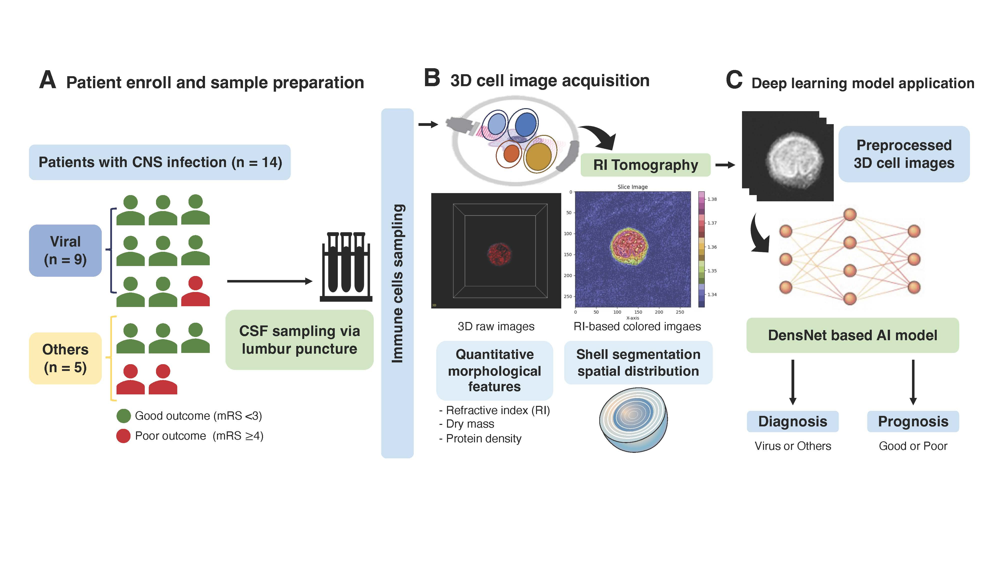
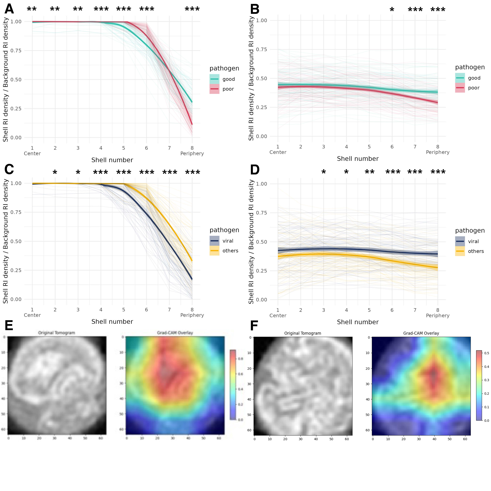

# Deep-Learning model for central nervous system infection diagnosis and prognosis using label-free 3D immune-cell morphology in the cerebrospinal fluid

## Overview



## 1. Patient enroll and sample preparation (A)
We performed a prospective cohort study between January and October 2022 at Severance Hospital in Seoul, Republic of Korea. 

Patients who met the following inclusion criteria were enrolled: 
- (1) presenting with fever, headache, and other neurological abnormalities prompting clinical suspicion of encephalitis or meningitis; 
- (2) >10 cells/μL in the CSF sample; and (3) age >18 years. 

Between January and October 2022, <b>14 patients with CNS infections were enrolled in this study.</b>

## 2. 3D Cell Image Acquisition & Preprocessing
### 2-1. Cell Image Acquisition
All 3D cell structural images of the immune cells in the CSF were captured using <b>3D holotomography </b>(HT-2H; Tomocube Inc., Daejeon, Republic of Korea), which reconstructs 3D RI portrayals by merging various 2D quantitative phase images.


### 2-2. Image preprocessing
<b>Exclusion : </b>
- Manual exclusion of sub-par instances (encompassing low-quality, low-resolution, and noisy backdrop depictions)
- Images exhibiting excessive adjacency of two or more cells

<b>Preprocessing :</b>
- <u>Centre-cropping process</u> to a size of 64 × 64 × 64 pixels & <u>centred around the morphological centre</u> co-ordinates determined manually during the previous curation process.


=><b>Through this process, 463 images were excluded from the initial set of 1,890 images, resulting in 1,427 images being used for training.</b> 

### 2-3. Sample data sharing
Here is the Google Drive link for all <u>processed NumPy files and part of Raw data</u> of 3D label-free immune cells from cerebrospinal fluids of the patients with central nervous infection at the <b>[Google Drive](https://drive.google.com/drive/folders/1---UpcPPSYeLeMHsh9VxgRubVkXziMeZ?usp=sharing)</b>


## 3. Deep Learning Model Application


### 3-1. Model and Hyperparameters
- Model : DenseNet
- Loss function : Cross Entropy Loss
- Optimizer : SGD (lr 0.0001) & cosine annealing scheduler 
- Batch size : 8
- Requires VRAM at least 16GB for training

### 3-2. How to Run?
#### 1) <b> Directory Description</b>
<pre>
Root
├── img
│   ├── Figure1.jpg : Overview
│   └── Figure3.jpg : Result
├── src : source codes for training the models and validate the result
│   ├── accuracy.py
│   ├── ...
│   └── train.py
├── check_accuracy.py
├── config.py : Configure of the training details
├── create_task.py : Load data information and split train-valid-test by the given task
├── draw_gradcam.py : Interpretation
├── main.py : Main file for training the file
├── <b>overview.ipynb</b> : Overview of the model and get sample output
├── Readme.md : this file
└── task.yaml : User can specify the task for running.
</pre>


#### 2) How to start?
<b> Initialize Virtual Venv </b>
```bash
python -m venv csf_venv # must be 3.9.12, check with python -V
source csf_venv/bin/activate
pip install -r requirements.txt
```
<b> Good or Poor Prognosis </b>
```bash
bash run_task.sh prognosis csf_good_poor
```

<b> Virus vs Others </b>
```bash
bash run_task.sh virus_others csf_vo
```